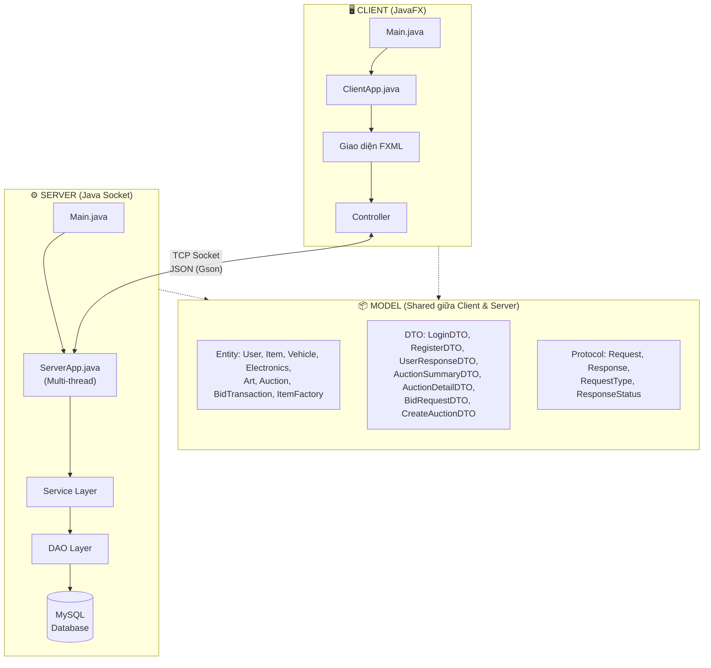
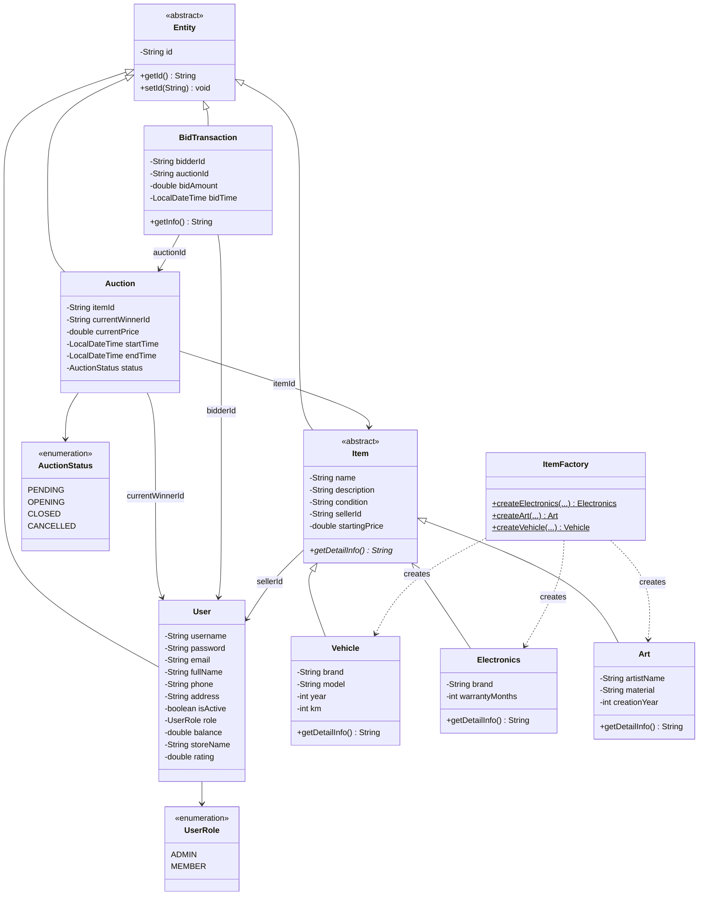
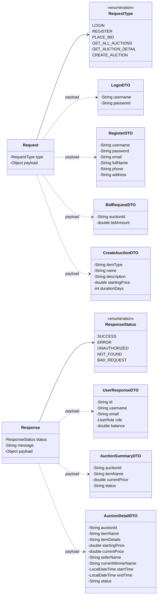

<div align="center">

# 🏛️ HỆ THỐNG ĐẤU GIÁ TRỰC TUYẾN
### Online Auction System

**Bài tập lớn môn Lập trình mạng**

**Giảng viên hướng dẫn:** *(Tên giảng viên)*

Học kỳ II — Năm học 2025–2026

</div>

---

## 📖 Giới thiệu

**Hệ thống Đấu giá Trực tuyến** là một ứng dụng phân tán Client-Server cho phép nhiều người dùng tham gia mua bán, đấu giá sản phẩm theo thời gian thực thông qua mạng.

Dự án giải quyết bài toán **mô phỏng quy trình đấu giá trực tuyến**: người bán đăng sản phẩm lên hệ thống, nhiều người mua cùng tham gia đặt giá cạnh tranh trong một khoảng thời gian giới hạn, hệ thống tự động xác định người thắng cuộc khi phiên đấu giá kết thúc. Ứng dụng hỗ trợ phân quyền Admin/Member, quản lý nhiều loại sản phẩm (Phương tiện, Đồ điện tử, Nghệ thuật) và xử lý đồng thời nhiều kết nối từ các client khác nhau.

---

## 👥 Thành viên nhóm & Phân công công việc

| STT | Họ và tên | MSSV | GitHub | Công việc |
|:---:|:----------|:----:|:-------|:----------|
| 1 | Phùng Anh Dũng | — | `padungg` | **Thiết kế kiến trúc & Model Layer:** Khởi tạo dự án, cấu hình Maven/CI-CD, thiết kế toàn bộ Entity (User, Item, Auction, BidTransaction), DTO, Protocol, áp dụng Factory Pattern |
| 2 | Nguyễn Văn Hưng | — | `ngvh2312` | **Front-end (Client):** Thiết kế giao diện JavaFX (đăng nhập, trang chủ, chi tiết đấu giá, tạo phiên mới), xử lý sự kiện UI, kết nối Client Socket đến Server |
| 3 | Bảo | — | `baothebean` | **Back-end (Server):** Xây dựng Socket Server đa luồng, triển khai DAO Layer (UserDAO, ItemDAO, AuctionDAO, BidTransactionDAO), kết nối MySQL, xử lý các Request từ Client |
| 4 | *(Tên thành viên 4)* | — | — | **Service Layer & Business Logic:** Xây dựng các Service (UserService, AuctionService, BidService), xử lý logic đấu giá, validation dữ liệu, đồng bộ hóa khi nhiều user bid cùng lúc, viết Unit Test |

---

## 🛠 Công nghệ sử dụng

| Công nghệ | Phiên bản | Vai trò |
|:-----------|:---------:|:--------|
| **Java** | 25 | Ngôn ngữ lập trình chính |
| **JavaFX** | 22.0.1 | Xây dựng giao diện người dùng (GUI) |
| **Java Socket** | — | Giao tiếp mạng Client ↔ Server |
| **MySQL** | 8.0+ | Cơ sở dữ liệu quan hệ |
| **Gson** | 2.10.1 | Serialize / Deserialize JSON qua Socket |
| **Maven** | 3.9+ | Quản lý thư viện & build dự án |
| **JUnit 5** | 5.10.0 | Viết Unit Test |
| **GitHub Actions** | — | CI/CD tự động kiểm tra build |

---

## ⭐ Chức năng chính

### Người dùng (Member)
- ✅ **Đăng ký / Đăng nhập** tài khoản với xác thực bảo mật
- ✅ **Xem danh sách** phiên đấu giá đang diễn ra (trang chủ)
- ✅ **Xem chi tiết** phiên đấu giá (thông tin sản phẩm, giá hiện tại, thời gian còn lại)
- ✅ **Đặt giá (Bid)** theo thời gian thực — hệ thống kiểm tra giá hợp lệ trước khi chấp nhận
- ✅ **Đăng bán sản phẩm** — tạo phiên đấu giá mới với thời gian tùy chọn
- ✅ **Hỗ trợ 3 loại sản phẩm:** Phương tiện (xe cộ), Đồ điện tử, Tác phẩm nghệ thuật

### Quản trị viên (Admin)
- ✅ **Quản lý người dùng** — kích hoạt/vô hiệu hóa tài khoản
- ✅ **Quản lý phiên đấu giá** — duyệt, hủy phiên đấu giá

### Kỹ thuật nổi bật
- 🔥 **Multi-thread Server** — xử lý đồng thời nhiều Client kết nối cùng lúc
- 🔥 **JSON Protocol** — giao thức Request/Response chuẩn hóa qua Socket
- 🔥 **Factory Pattern** — tạo linh hoạt các loại sản phẩm khác nhau
- 🔥 **DTO Pattern** — tách biệt dữ liệu truyền mạng và entity nội bộ, bảo mật thông tin nhạy cảm (password)
- 🔥 **Synchronized Bidding** — đồng bộ hóa khi nhiều user đặt giá cùng một phiên

---

## 📐 Sơ đồ kiến trúc hệ thống



---

## 📐 Sơ đồ lớp (Class Diagram)

### 1. Entity Layer — Các lớp thực thể



### 2. DTO & Protocol Layer



---

## 📁 Cấu trúc thư mục

```
auction-system/
├── pom.xml                              # Cấu hình Maven
├── database.txt                         # Dữ liệu mẫu
├── src/
│   ├── main/java/com/auction/
│   │   ├── client/                      # CLIENT
│   │   │   ├── Main.java
│   │   │   └── ClientApp.java
│   │   ├── model/                       # MODEL (Shared)
│   │   │   ├── entity/                  #   Entity classes
│   │   │   ├── dto/                     #   Data Transfer Objects
│   │   │   └── protocol/               #   Request / Response
│   │   └── server/                      # SERVER
│   │       ├── Main.java
│   │       ├── ServerApp.java
│   │       ├── controller/
│   │       └── dao/
│   └── resources/
│       ├── hello-view.fxml              # Giao diện đăng nhập
│       ├── views/                       # Các file FXML khác
│       └── images/                      # Tài nguyên ảnh
└── .github/workflows/                   # CI/CD Pipeline
```

---

## 🚀 Hướng dẫn Cài đặt & Chạy dự án

### Yêu cầu cài đặt trước

| Phần mềm | Phiên bản tối thiểu | Link tải |
|:----------|:-------------------:|:---------|
| JDK | 25+ | [Oracle JDK](https://www.oracle.com/java/technologies/downloads/) |
| Maven | 3.9+ | [Apache Maven](https://maven.apache.org/download.cgi) |
| MySQL | 8.0+ | [MySQL Community](https://dev.mysql.com/downloads/) |

### Bước 1 — Clone dự án

```bash
git clone https://github.com/padungg/auction-system.git
cd auction-system
```

### Bước 2 — Tạo cơ sở dữ liệu MySQL

Mở **MySQL Workbench** hoặc terminal MySQL, chạy script tạo database:

```sql
-- Tạo database
CREATE DATABASE IF NOT EXISTS auction_db;
USE auction_db;

-- (Chạy file script SQL đầy đủ nằm trong thư mục /sql/init.sql)
```

> ⚠️ **Lưu ý:** Cập nhật thông tin kết nối database (host, port, username, password) trong file cấu hình trước khi chạy.

### Bước 3 — Cài đặt thư viện

```bash
mvn clean install
```

### Bước 4 — Khởi động Server ***(chạy trước)***

```bash
# Mở Terminal 1 — Bật Server lên trước
mvn exec:java -Dexec.mainClass="com.auction.server.Main"
```

Khi thấy dòng sau tức là Server đã sẵn sàng:
```
>>> [Hệ thống]: SERVER ĐANG CHẠY... ĐANG ĐỢI KẾT NỐI TẠI CỔNG 1234...
```

### Bước 5 — Khởi động Client ***(chạy sau)***

```bash
# Mở Terminal 2 — Bật Client
mvn javafx:run
```

Cửa sổ giao diện đăng nhập sẽ hiện ra. Nhập tài khoản và mật khẩu để sử dụng hệ thống.

### Tài khoản mẫu

| Tài khoản | Mật khẩu | Vai trò |
|:----------|:---------|:--------|
| `admin` | `123` | Admin |

---

## 🎨 Design Patterns áp dụng

| Pattern | Vị trí áp dụng |
|:--------|:----------------|
| **Factory Pattern** | `ItemFactory` — Tạo các loại Item (Vehicle, Electronics, Art) |
| **DTO Pattern** | Tách biệt dữ liệu truyền mạng và entity, bảo mật password |
| **DAO Pattern** | `UserDAOImpl` — Tách riêng logic truy xuất cơ sở dữ liệu |
| **MVC Pattern** | Controller (JavaFX) → Service → DAO |
| **Envelope Pattern** | `Request` / `Response` — Đóng gói thống nhất giao thức mạng |

---

<div align="center">

📝 *Dự án được phát triển bởi nhóm sinh viên — Học kỳ II, 2025–2026*

</div>
