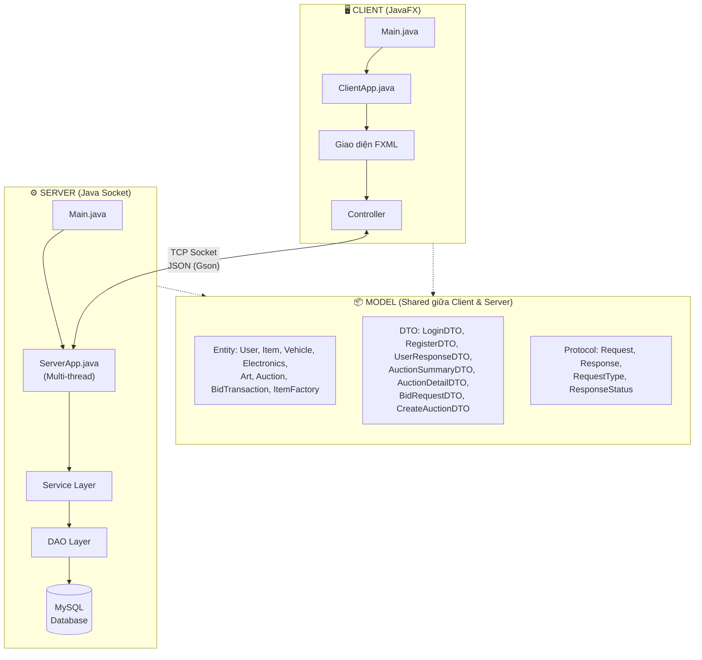
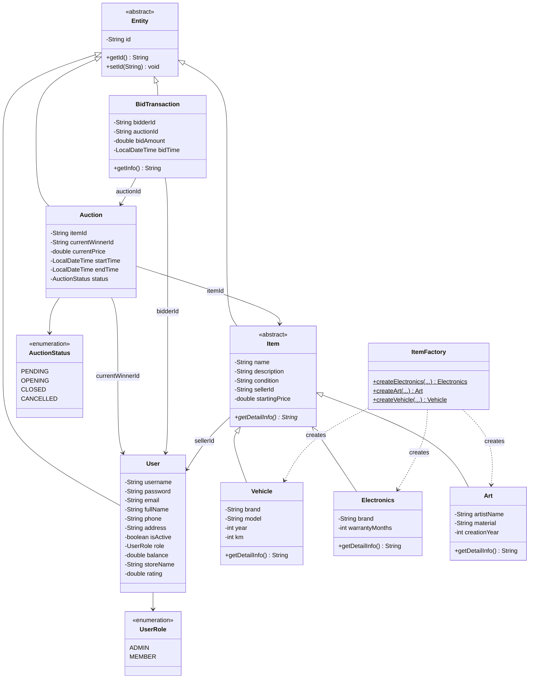
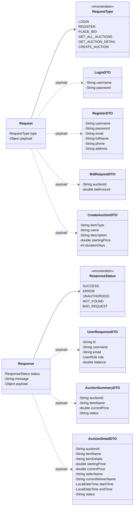

# HỆ THỐNG ĐẤU GIÁ TRỰC TUYẾN
### Online Auction System

## Giới thiệu

**Hệ thống Đấu giá Trực tuyến** là một ứng dụng phân tán Client-Server cho phép nhiều người dùng tham gia mua bán, đấu giá sản phẩm theo thời gian thực thông qua mạng.

Dự án giải quyết bài toán **mô phỏng quy trình đấu giá trực tuyến**: người bán đăng sản phẩm lên hệ thống, nhiều người mua cùng tham gia đặt giá cạnh tranh trong một khoảng thời gian giới hạn, hệ thống tự động xác định người thắng cuộc khi phiên đấu giá kết thúc. Ứng dụng hỗ trợ phân quyền Admin/Member, quản lý nhiều loại sản phẩm (Phương tiện, Đồ điện tử, Nghệ thuật,...) và xử lý đồng thời nhiều kết nối từ các client khác nhau.

---

## Cấu trúc thư mục (Dự kiến)
Dự án được tổ chức chặt chẽ theo mô hình Client-Server với cấu trúc gói (package) như sau:
* `com.auction.client`: Chứa toàn bộ logic phía Client (Controller, Network xử lý giao tiếp, Util khởi chạy app).
* `com.auction.model`: Chứa các lớp thực thể (Entity, DTO), Request/Response dùng chung cho cả Client và Server.
* `com.auction.server`: Chứa logic phía Server (Socket Server đa luồng, xử lý Database, DAO, Service).
* `resources`: Chứa các tài nguyên giao diện, hình ảnh và tệp `.fxml`.

---

## Thành viên nhóm & Phân công công việc

**Công việc chung của toàn nhóm:** Thiết kế Model (Entity, DTO, Request/Response Protocol) và thảo luận thiết kế Cấu trúc kiến trúc phân tầng của dự án.

| STT | Họ và tên                 | MSSV | GitHub       | Chuyên trách chính        | Chi tiết công việc tương ứng với Cấu trúc thư mục |
|:---:|:--------------------------|:-----|:-------------|:--------------------------|:--------------------------------------------------|
| 1   | **Phùng Anh Dũng** | —    | `padungg`    | **Model Layer** | Chịu trách nhiệm gói `com.auction.model`. Xây dựng các lớp đối tượng cốt lõi (Entity), định nghĩa cấu trúc gói tin giao tiếp (Request/Response Protocol) và áp dụng các tính chất OOP. |
| 2   | **Nguyễn Minh Nhật Anh** | —    | `nhatdog34`     | **Server & Database** | Chịu trách nhiệm gói `com.auction.server`. Xây dựng Server Socket đa luồng, xử lý Database (MySQL, DAO Layer), điều hướng logic và xử lý nghiệp vụ trung tâm. |
| 3   | **Nguyễn Viết Hưng** | —    | `ngvh2312`   | **Client Logic & Network**| Chịu trách nhiệm gói `com.auction.client`. Xây dựng Socket Client kết nối đến Server, xử lý luồng dữ liệu (JSON/Gson) và lập trình các lớp Controller điều khiển sự kiện trên UI. |
| 4   | **Đậu Đình Gia Bảo** | —    | `baothebean` | **Giao diện (UI/UX FXML)**| Chịu trách nhiệm thư mục `resources`. Thiết kế toàn bộ giao diện JavaFX bằng các file `.fxml` (Login, Admin, Dashboard, Manage, View...), tổ chức tài nguyên hình ảnh, đảm bảo UI/UX. |****

## 📐 Sơ đồ kiến trúc hệ thống

---

## 📐 Sơ đồ lớp (Class Diagram)

### 1. Entity Layer — Các lớp thực thể

### 2. DTO & Protocol Layer

---

## 🎨 Design Patterns áp dụng

| Pattern | Vị trí áp dụng |
|:--------|:----------------|
| **Factory Pattern** | `ItemFactory` — Tạo các loại Item (Vehicle, Electronics, Art) |
| **DTO Pattern** | Tách biệt dữ liệu truyền mạng và entity, bảo mật password |
| **DAO Pattern** | `UserDAOImpl` — Tách riêng logic truy xuất cơ sở dữ liệu |
| **MVC Pattern** | Controller (JavaFX) → Service → DAO |
| **Envelope Pattern** | `Request` / `Response` — Đóng gói thống nhất giao thức mạng |

---

