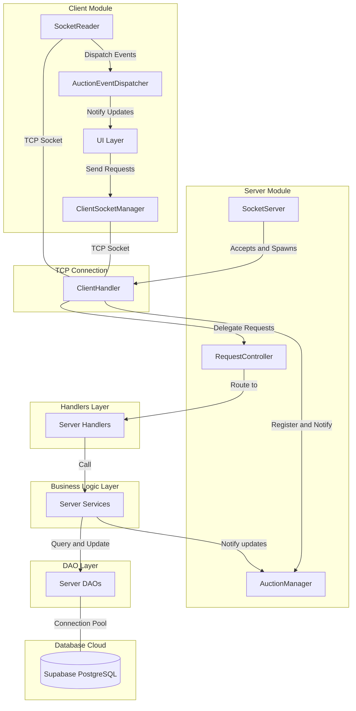
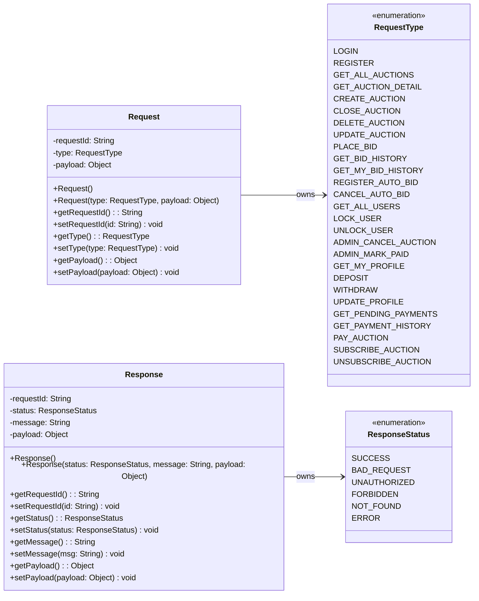
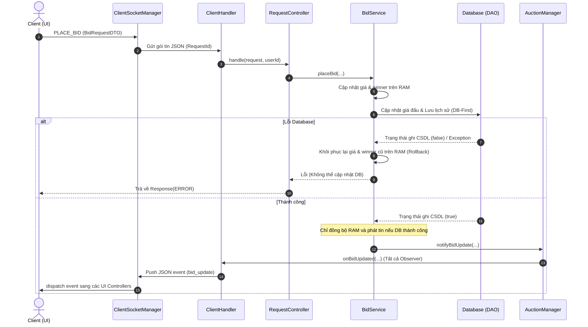
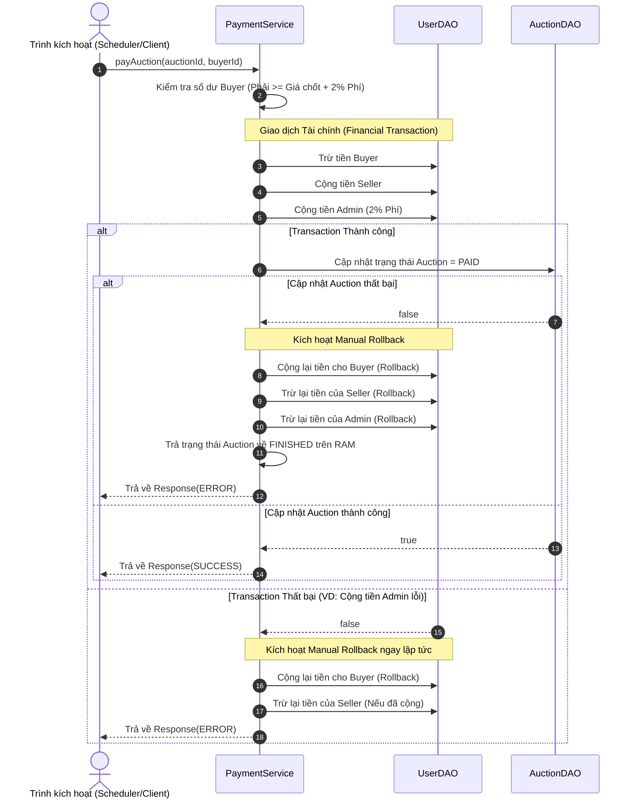

# THIẾT KẾ LỚP CHI TIẾT - UET AUCTION SYSTEM

---

## 1. Kiến trúc hệ thống & Mẫu thiết kế

### 1.1 Sơ đồ kiến trúc tổng quan

### 1.2 Mẫu thiết kế áp dụng

#### Mẫu thiết kế GoF (Gang of Four)
* **Factory Method / Simple Factory** (`ItemFactory`): Khởi tạo đa hình sản phẩm (`Art`, `Electronics`, `Vehicle`) từ lớp cha `Item` dựa trên DTO.
* **Observer Pattern** (`AuctionManager` / `AuctionEventDispatcher`): Phát tán cập nhật giá thầu thời gian thực từ Server đến toàn bộ Client đang theo dõi.
* **Singleton Pattern** (`ClientSocketManager`, `AuctionManager`, `AppConfig`): Đảm bảo duy nhất thực thể quản lý kết nối, observer và cấu hình DI để tránh tranh chấp tài nguyên.

#### Mẫu thiết kế Kiến trúc & Doanh nghiệp
* **Data Access Object (DAO)**: Tách biệt logic SQL khỏi tầng Service qua các Interface.
* **Front Controller & Command**: `RequestController` làm đầu mối định tuyến tập trung, ánh xạ và gọi thực thi các `RequestHandler` (Command).

#### Mẫu thiết kế Xử lý đồng thời (Concurrency)
* **Initialization-on-demand Holder**: Khởi tạo lười biếng (Lazy) và an toàn đa luồng cho Singleton.
* **Segmented Locking**: `LockManager` quản lý khóa phân đoạn theo `auctionId` (`ReentrantLock`) tránh lost update khi đấu giá đồng thời.

---

## 2. Sơ đồ UML các lớp miền thực thể (Domain Entities)

```mermaid
classDiagram
    direction TB
    
    class Entity {
        <<abstract>>
        -id: String
        +Entity()
        +Entity(id: String)
        +getId(): String
        +setId(id: String) void
    }

    class User {
        -username: String
        -password: String
        -email: String
        -fullName: String
        -phone: String
        -address: String
        -isActive: boolean
        -role: UserRole
        -balance: double
        -storeName: String
        -rating: double
        +User()
        +User(id, username, password, email, fullName, phone, address, isActive, role, balance, storeName, rating)
        +deposit(amount: double) void
        +withdraw(amount: double) void
        +getUsername(): String
        +getPassword(): String
        +setPassword(password: String) void
        +getEmail(): String
        +setEmail(email: String) void
        +getFullName(): String
        +setFullName(fullName: String) void
        +getPhone(): String
        +setPhone(phone: String) void
        +getAddress(): String
        +setAddress(address: String) void
        +isActive(): boolean
        +setActive(active: boolean) void
        +getRole(): UserRole
        +setRole(role: UserRole) void
        +getBalance(): double
        +setBalance(balance: double) void
        +getStoreName(): String
        +setStoreName(storeName: String) void
        +getRating(): double
        +setRating(rating: double) void
    }

    class Item {
        <<abstract>>
        -name: String
        -description: String
        -condition: String
        -sellerId: String
        -startingPrice: double
        -imageBase64: String
        +Item()
        +Item(id, name, description, condition, sellerId, startingPrice)
        +getItemType()* ItemType
        +applyUpdate(dto: UpdateAuctionDTO)* void
        +getDetailInfo()* String
        +getName(): String
        +setName(name: String) void
        +getDescription(): String
        +setDescription(description: String) void
        +getStartingPrice(): double
        +setStartingPrice(price: double) void
        +getCondition(): String
        +setCondition(cond: String) void
        +getSellerId(): String
        +getImageBase64(): String
        +setImageBase64(base64: String) void
    }

    class Art {
        -artistName: String
        -material: String
        -creationYear: int
        +Art()
        +Art(id, name, description, condition, sellerId, startingPrice, artistName, material, creationYear)
        +getItemType(): ItemType
        +applyUpdate(dto: UpdateAuctionDTO) void
        +getDetailInfo(): String
    }

    class Electronics {
        -brand: String
        -warrantyMonths: int
        +Electronics()
        +Electronics(id, name, description, condition, sellerId, startingPrice, brand, warrantyMonths)
        +getItemType(): ItemType
        +applyUpdate(dto: UpdateAuctionDTO) void
        +getDetailInfo(): String
    }

    class Vehicle {
        -brand: String
        -model: String
        -year: int
        -km: int
        +Vehicle()
        +Vehicle(id, name, description, condition, sellerId, startingPrice, brand, model, year, km)
        +getItemType(): ItemType
        +applyUpdate(dto: UpdateAuctionDTO) void
        +getDetailInfo(): String
    }

    class Auction {
        -itemId: String
        -currentWinnerId: String
        -currentPrice: double
        -startTime: LocalDateTime
        -endTime: LocalDateTime
        -status: AuctionStatus
        -stepPrice: double
        +Auction()
        +Auction(id, itemId, currentPrice, startTime, endTime)
        +getItemId(): String
        +getCurrentWinnerId(): String
        +setCurrentWinnerId(id: String) void
        +getCurrentPrice(): double
        +setCurrentPrice(price: double) void
        +getStartTime(): LocalDateTime
        +getEndTime(): LocalDateTime
        +setEndTime(time: LocalDateTime) void
        +getStatus(): AuctionStatus
        +setStatus(status: AuctionStatus) void
        +getSecondsRemaining(): long
        +extendEndTime(seconds: long) void
        +getStepPrice(): double
        +setStepPrice(price: double) void
    }

    class BidTransaction {
        -bidderId: String
        -auctionId: String
        -bidAmount: double
        -bidTime: LocalDateTime
        -isAutoBid: boolean
        +BidTransaction()
        +BidTransaction(id, bidderId, auctionId, bidAmount, bidTime)
        +BidTransaction(id, bidderId, auctionId, bidAmount, bidTime, isAutoBid)
        +getBidderId(): String
        +getAuctionId(): String
        +getBidAmount(): double
        +getBidTime(): LocalDateTime
        +isAutoBid(): boolean
        +getInfo(): String
    }

    class AutoBidEntry {
        -userId: String
        -auctionId: String
        -maxBid: double
        -increment: double
        -registeredAt: LocalDateTime
        +AutoBidEntry(userId, auctionId, maxBid, increment)
        +AutoBidEntry(userId, auctionId, maxBid, increment, registeredAt)
        +compareTo(other: AutoBidEntry) int
        +getUserId(): String
        +getAuctionId(): String
        +getMaxBid(): double
        +getIncrement(): double
        +getRegisteredAt(): LocalDateTime
    }

    class ItemFactory {
        +createItemFromDTO(id, sellerId, condition, dto: CreateAuctionDTO) Item$
    }

    class UserRole {
        <<enumeration>>
        ADMIN
        MEMBER
    }

    class ItemType {
        <<enumeration>>
        ELECTRONICS
        ART
        VEHICLE
    }

    class AuctionStatus {
        <<enumeration>>
        OPEN
        RUNNING
        FINISHED
        PAID
        CANCELED
    }

    Entity <|-- User
    Entity <|-- Item
    Entity <|-- Auction
    Entity <|-- BidTransaction
    Item <|-- Art
    Item <|-- Electronics
    Item <|-- Vehicle
    Comparable <|.. AutoBidEntry
    ItemFactory ..> Item : instantiates
    UserRole <-- User : uses
    ItemType <-- Item : uses
    AuctionStatus <-- Auction : uses
```

---

## 3. Giao thức truyền thông & DTOs

### 3.1 Sơ đồ UML Request/Response

### 3.2 Bảng đặc tả các DTO (Data Transfer Objects)

| DTO Class | Thuộc tính chính | Mục đích / Nghiệp vụ |
| :--- | :--- | :--- |
| **`LoginDTO`** | username, password | Đóng gói thông tin đăng nhập từ Client lên Server. |
| **`RegisterDTO`** | username, password, email, fullName, phone, address, storeName | Đóng gói thông tin đăng ký tài khoản thành viên mới. |
| **`UserResponseDTO`** | id, username, email, fullName, phone, address, role, balance, storeName, rating | Trả về thông tin cá nhân của người dùng (bảo mật mật khẩu). |
| **`CreateAuctionDTO`** | name, description, condition, startingPrice, stepPrice, durationHours, durationMinutes, itemType, imageBase64, brand, model, year, km, warrantyMonths, artistName, material, creationYear | Gom toàn bộ trường động để tạo phiên đấu giá cho cả 3 loại sản phẩm. |
| **`UpdateAuctionDTO`** | name, description, condition, imageBase64, brand, model, year, km, warrantyMonths, artistName, material, creationYear | Cập nhật thông tin chi tiết sản phẩm. |
| **`AuctionSummaryDTO`** | id, itemName, currentPrice, endTime, status, itemType, sellerName, imageBase64 | Hiển thị tóm tắt danh sách phiên để tối ưu hóa bộ nhớ và băng thông. |
| **`AuctionDetailDTO`** | Toàn bộ trường của `Auction` & `Item` tương ứng, thông tin `sellerName` & `currentWinnerName` | Hiển thị thông tin chi tiết trên trang sản phẩm. |
| **`BidRequestDTO`** | auctionId, bidAmount | Gửi yêu cầu đặt giá thầu thủ công. |
| **`AutoBidDTO`** | auctionId, maxBid, increment | Gửi yêu cầu cấu hình giới hạn tự động đấu giá. |
| **`MyBidHistoryDTO`** | id, auctionId, itemName, bidAmount, bidTime, isAutoBid, status | Hiển thị danh sách lịch sử đấu giá cá nhân. |
| **`BidUpdateNotificationDTO`** | auctionId, newPrice, bidderId, bidderName, itemName, bidTime | Server phát sóng realtime cho các client khi có bid mới thành công. |
| **`AuctionClosedNotificationDTO`** | auctionId, finalPrice, winnerId | Server phát sóng realtime cho các client khi kết thúc phiên. |

---

## 4. Kiến trúc lớp phía Server (Server Module)

### 4.1 Sơ đồ UML tổng thể

```mermaid
classDiagram
    direction TB

    %% TẦNG NETWORK & OBSERVER
    class SocketServer {
        -port: int
        -controller: RequestController
        -serverSocket: ServerSocket
        -running: boolean
        -executor: ExecutorService
        +SocketServer(port, controller)
        +start() void
        +stop() void
    }

    class ClientHandler {
        -socket: Socket
        -controller: RequestController
        -in: BufferedReader
        -out: PrintWriter
        -loggedInUserId: String
        +ClientHandler(socket, controller)
        +run() void
        +onBidUpdated(auctionId, newPrice, bidderId, bidderName, itemName, bidTime, newEndTime) void
        +onAuctionClosed(auctionId, finalPrice, winnerId) void
        -handleRawMessage(json: String) void
        -handleSubscriptionRequest(request: Request) boolean
        -sendResponse(response: Response) void
        -sendPush(json: String) void
        -cleanup(clientAddr: String) void
    }

    class AuctionObserver {
        <<interface>>
        +onBidUpdated(auctionId, newPrice, bidderId, bidderName, itemName, bidTime, newEndTime)* void
        +onAuctionClosed(auctionId, finalPrice, winnerId)* void
    }

    class AuctionManager {
        -observerMap: Map<String, List<AuctionObserver>>
        -AuctionManager()
        +getInstance() AuctionManager$
        +subscribe(auctionId, observer: AuctionObserver) void
        +unsubscribe(auctionId, observer: AuctionObserver) void
        +unsubscribeAll(observer: AuctionObserver) void
        +notifyBidUpdate(auctionId, newPrice, bidderId, bidderName, itemName, bidTime, newEndTime) void
        +notifyAuctionClosed(auctionId, finalPrice, winnerId) void
    }

    %% TẦNG CONTROLLER & HANDLERS
    class RequestController {
        -handlerMap: Map<RequestType, RequestHandler>
        +RequestController(userService, walletService, auctionService, bidService, autoBidService, paymentService)
        +handle(request, loggedInUserId) Response
    }

    class RequestHandler {
        <<interface>>
        +handle(request, loggedInUserId)* Response
    }

    class BaseHandler {
        <<abstract>>
        #GSON: Gson
        #parsePayload(request, clazz: Class<T>) T
        #parsePayload(request, typeOfT: Type) T
    }

    class AuctionHandler {
        -auctionService: AuctionService
        +AuctionHandler(auctionService)
        +handle(request, loggedInUserId) Response
    }

    %% TẦNG SERVICES
    class AuctionService {
        -auctionDAO: AuctionDAO
        -userDAO: UserDAO
        -itemService: ItemService
        -auctionMapper: AuctionMapper
        -autoBidService: AutoBidService
        +AuctionService(auctionDAO, userDAO, itemService, auctionMapper, autoBidService)
        +getAllAuctions(): Response
        +getAuctionDetail(auctionId): Response
        +createAuction(dto: CreateAuctionDTO, sellerId): Response
        +closeAuction(auctionId): Response
        +deleteAuctionItem(auctionId, sellerId): Response
        +updateAuctionItem(dto: UpdateAuctionDTO, sellerId): Response
    }

    %% TẦNG DAOS
    class AuctionDAO {
        <<interface>>
        +findAllByStatus(status: AuctionStatus) List<Auction>
        +findById(id: String) Auction
        +save(auction: Auction) boolean
        +update(auction: Auction) boolean
        +delete(id: String) boolean
        +findAll() List<Auction>
        +findByCurrentWinnerId(winnerId: String) List<Auction>
    }

    class AuctionDAOImpl {
        -connectionPool: HikariDataSource
        +findAllByStatus(status) List<Auction>
        +findById(id) Auction
        +save(auction) boolean
        +update(auction) boolean
        +delete(id) boolean
        +findAll() List<Auction>
        +findByCurrentWinnerId(winnerId) List<Auction>
    }

    %% QUAN HỆ GIỮA CÁC THÀNH PHẦN
    SocketServer --> ClientHandler : spawns
    Runnable <|.. ClientHandler
    AuctionObserver <|.. ClientHandler
    AuctionManager --> AuctionObserver : notifies
    ClientHandler --> RequestController : routes request to
    RequestController --> RequestHandler : delegates to
    RequestHandler <|.. BaseHandler
    BaseHandler <|-- AuctionHandler
    AuctionHandler --> AuctionService : invokes
    AuctionService --> AuctionDAO : reads/writes DB
    AuctionDAO <|.. AuctionDAOImpl
```

### 4.2 Đặc tả nhiệm vụ các lớp Server

*   **Tầng Network**:
    *   `SocketServer`: Lắng nghe kết nối TCP mới và khởi chạy một thread `ClientHandler` cho mỗi Client.
    *   `ClientHandler`: Nhận/gửi JSON qua socket và triển khai `AuctionObserver` để nhận tin nhắn đẩy realtime.
*   **Tầng Controller & Handlers**:
    *   `RequestController`: Router trung tâm quản lý bản đồ ánh xạ `RequestType -> RequestHandler`.
    *   `AccountHandler`, `AdminHandler`, `AuctionHandler`, `AutoBidHandler`, `BidHandler`, `PaymentHandler`, `UserHandler`: Các Command Handler phân tích payload và gọi dịch vụ thích hợp.
*   **Tầng Service (Nghiệp vụ)**:
    *   `UserService`: Mã hóa mật khẩu, kiểm tra tài khoản, quản lý trạng thái khóa/mở.
    *   `WalletService`: Xử lý nạp, rút, xem ví điện tử.
    *   `ItemService`: Xử lý logic tạo mới và cập nhật sản phẩm thô.
    *   `AuctionService`: Quản lý vòng đời phiên đấu giá, tính toán thời gian.
    *   `BidService`: Đặt thầu thủ công, kiểm tra tính hợp lệ của giá, kiểm tra anti-sniping, kích hoạt `AutoBidService`.
    *   `AutoBidService`: Duyệt hàng đợi ưu tiên để tự động đặt giá thầu thay thế đối thủ khi có giá mới.
    *   `PaymentService`: Tự động trích tiền chuyển ví khi kết thúc phiên và ghi nhận hóa đơn.
    *   `AuctionScheduler`: Scheduled Task quét database mỗi giây để chuyển đổi trạng thái phiên (`OPEN -> RUNNING -> FINISHED`).
*   **Tầng DAO (Truy xuất dữ liệu)**:
    *   `DatabaseConnection`: Quản lý kết nối pooling thông qua `HikariDataSource`.
    *   `UserDAO`, `AuctionDAO`, `ItemDAO`, `BidTransactionDAO`, `AutoBidDAO` (và các lớp `*Impl`): Ghi nhận và truy vấn trực tiếp vào database PostgreSQL.

---

## 5. Kiến trúc lớp phía Client (Client Module)

### 5.1 Sơ đồ UML tổng thể

```mermaid
classDiagram
    direction TB

    class Launcher {
        +main(args: String[])$ void
    }

    class ClientApp {
        +start(primaryStage: Stage) void
        +main(args: String[])$ void
    }

    class ClientSocketManager {
        -socket: Socket
        -out: PrintWriter
        -gson: Gson
        -pendingRequests: ConcurrentMap<String, CompletableFuture<Response>>
        -eventDispatcher: AuctionEventDispatcher
        -executor: ExecutorService
        -listenerFuture: Future
        -writeLock: Object
        -ClientSocketManager()
        +getInstance() ClientSocketManager$
        +connect(host: String, port: int) void
        +sendRequest(request: Request) Response
        +disconnect() void
        +isConnected(): boolean
        +addObserver(observer: AuctionEventObserver) void
        +removeObserver(observer: AuctionEventObserver) void
    }

    class SocketReader {
        -in: BufferedReader
        -gson: Gson
        -pendingRequests: ConcurrentMap<String, CompletableFuture<Response>>
        -dispatcher: AuctionEventDispatcher
        +SocketReader(in, gson, pendingRequests, dispatcher)
        +run() void
    }

    class AuctionEventDispatcher {
        -observers: CopyOnWriteArrayList<AuctionEventObserver>
        -taskExecutor: Consumer<Runnable>
        +addObserver(observer: AuctionEventObserver) void
        +removeObserver(observer: AuctionEventObserver) void
        +clear() void
        +setTaskExecutor(executor: Consumer<Runnable>) void
        +dispatch(eventName: String, auctionId: String, json: JsonObject) void
    }

    class AuctionEventObserver {
        <<interface>>
        +onAuctionEvent(event: String, auctionId: String, payload: JsonObject)* void
    }

    class MainController {
        -socketManager: ClientSocketManager
        +initialize() void
        +onAuctionEvent(event: String, auctionId: String, payload: JsonObject) void
    }

    class AuctionDetailController {
        -socketManager: ClientSocketManager
        +initialize() void
        +onAuctionEvent(event: String, auctionId: String, payload: JsonObject) void
    }

    ClientApp --> ClientSocketManager : initializes
    Launcher --> ClientApp : launches
    ClientSocketManager --> SocketReader : starts on thread
    Runnable <|.. SocketReader
    SocketReader --> AuctionEventDispatcher : dispatches updates
    AuctionEventDispatcher --> AuctionEventObserver : invokes callbacks
    AuctionEventObserver <|.. MainController
    AuctionEventObserver <|.. AuctionDetailController
    MainController --> ClientSocketManager : sends requests via
    AuctionDetailController --> ClientSocketManager : sends requests via
```

### 5.2 Đặc tả nhiệm vụ các lớp Client

*   **Tầng Network & Event**:
    *   `Launcher`: Điểm khởi chạy ứng dụng đồ học (vượt qua hạn chế cấu hình classpath).
    *   `ClientApp`: Nạp view login và thiết lập socket.
    *   `ClientSocketManager`: Quản lý gửi request đồng bộ (dùng `CompletableFuture` chờ tối đa 10 giây) và phân phát sự kiện bất đồng bộ.
    *   `SocketReader`: Thread chạy ngầm liên tục đọc các dòng JSON trả về từ Server.
    *   `AuctionEventDispatcher`: Định tuyến và đẩy sự kiện realtime về giao diện thông qua `Platform.runLater()`.
    *   `SessionManager`: Singleton lưu thông tin người dùng đăng nhập hiện tại.
*   **Tầng UI Controllers (Xử lý sự kiện FXML)**:
    *   `LoginController`: Xử lý đăng ký và đăng nhập, đổi sang trang Main hoặc Admin.
    *   `MainController`: Trang chủ của member (nạp/rút tiền, menu chính).
    *   `AdminController`: Trang quản trị viên (khóa user, duyệt hóa đơn, hủy phiên).
    *   `AuctionListController`: Hiển thị lưới sản phẩm đấu giá, hỗ trợ bộ lọc.
    *   `ProductCardController`: Card hiển thị nhanh thông tin sản phẩm đơn lẻ.
    *   `AuctionDetailController`: Hiển thị chi tiết phiên đấu giá, vẽ biểu đồ LineChart biến động giá realtime và xử lý đặt thầu.
    *   `ManageSellerController`: Quản lý danh sách hàng tự đăng bán của người dùng.
    *   `EditAuctionDialogController`: Hộp thoại sửa thông tin đấu giá chưa chạy.
    *   `PaymentController`: Quản lý thanh toán hóa đơn các phiên đấu giá thắng cuộc.

---

## 6. Quy trình xử lý Real-time (Bidding Flow) & Rollback

Sơ đồ trình tự (Sequence Diagram) dưới đây mô tả luồng đi của dữ liệu khi Client thực hiện đặt thầu, bao gồm cả **Cơ chế Rollback (Khôi phục RAM)** khi lưu vào CSDL thất bại:

---

## 7. Quy trình Thanh toán (Payment & Rollback Flow)

Sơ đồ trình tự mô tả quy trình thanh toán tự động khi phiên kết thúc, bao gồm cơ chế **Manual Compensation Rollback** để khôi phục số dư ví của các bên liên quan nếu giao dịch gặp lỗi:

